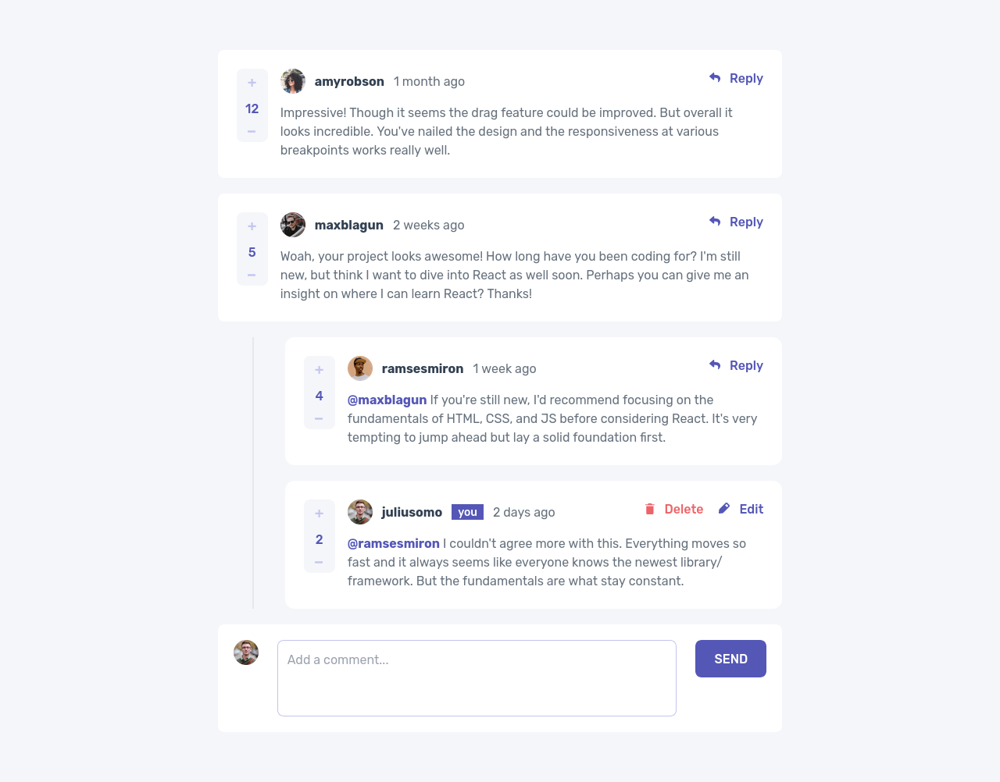

# Frontend Mentor - Interactive comments section solution

This is a solution to the [Interactive comments section challenge on Frontend Mentor](https://www.frontendmentor.io/challenges/interactive-comments-section-iG1RugEG9). Frontend Mentor challenges help you improve your coding skills by building realistic projects. 

## Table of contents

- [Frontend Mentor - Interactive comments section solution](#frontend-mentor---interactive-comments-section-solution)
  - [Table of contents](#table-of-contents)
  - [Overview](#overview)
    - [The challenge](#the-challenge)
    - [Screenshot](#screenshot)
    - [Links](#links)
  - [My process](#my-process)
    - [Built with](#built-with)
    - [What I learned](#what-i-learned)
    - [Useful resources](#useful-resources)
  - [Author](#author)
  - [Acknowledgments](#acknowledgments)

## Overview

### The challenge

Users should be able to:

- View the optimal layout for the app depending on their device's screen size
- See hover states for all interactive elements on the page
- Create, Read, Update, and Delete comments and replies
- Upvote and downvote comments
- **Bonus**: If you're building a purely front-end project, use `localStorage` to save the current state in the browser that persists when the browser is refreshed.
- **Bonus**: Instead of using the `createdAt` strings from the `data.json` file, try using timestamps and dynamically track the time since the comment or reply was posted.

### Screenshot

### Links

- Solution URL: [Frontend Mentor](https://www.frontendmentor.io/solutions/interactive-comment-section-with-vue-tailwind-and-vite-iKMtPenSag)
- Live Site URL: [GitHub Page](https://zenitsuag.github.io/interactive-comments-section/)

## My process

### Built with

- Semantic HTML5 markup
- CSS custom properties
- Flexbox
- CSS Grid
- Mobile-first workflow
- [Vue](https://vuejs.org/) - JS framework
- [Tailwind CSS](http://www.tailwindcss.com/) - CSS framework
- [Lodsash]() - JS utility library

### What I learned

I learnt Vue with the project. I feel like the challenges I faced have also made me an overall better developer. During the 
duration of this project which took more time than expected, I also partook in the VueJS Certification training and I learnt a
lot.

### Useful resources

- [Vue JS Docs](https://vuejs.org/guide/)

## Author

- Website - [Fred Robins](https://www.github.com/ZenitsuAg)
- Frontend Mentor - [@ZenitsuAg](https://www.frontendmentor.io/profile/ZenitsuAg)
- Twitter - [@yourusername](https://www.twitter.com/yourusername)

## Acknowledgments

- I give thanks to you, God Almighty for your grace and continuous support. Without you Lord Jesus, I wouldn't have come this far.
